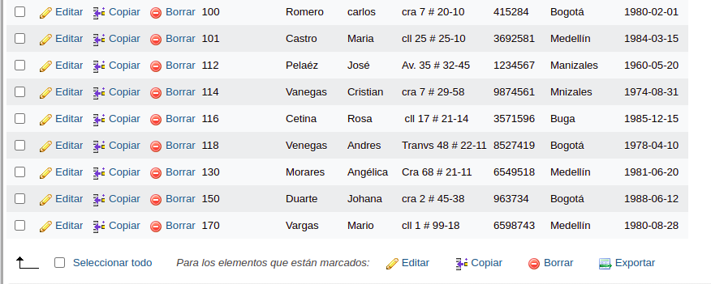
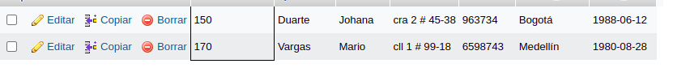

# consultas1_sql

#CONSULTAS SQL

1. Para visualizar toda la informacion que contiene la tabla `usuario` se puede incluir con la inclusion SELCET el caracter "*" o cada uno de los campos de la tabla
`select * from usuario`

2. Visualizar solamente la identificacion del usuario.

`select Identification from usuario`

